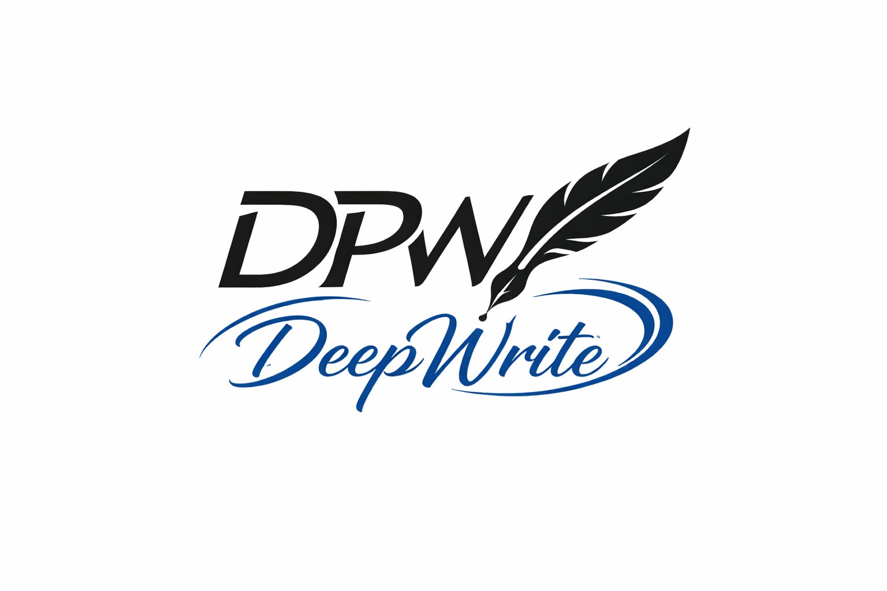

<div align="center">
  

  # DeepWrite

  沉浸式 AI 协作科研工作平台。
</div>

## 项目简介

DeepWrite 是一个 Monorepo 项目，目标是提供从内容创作到协作编辑的完整工作流：

- 产品定位：沉浸式 AI 协作科研工作平台
- 官网地址：https://deepwrite.work

- 文档编辑与版本管理
- 工作区与成员协作
- 基于 Yjs 的实时协作编辑
- 网关统一鉴权、存储、缓存与邮件能力

## 技术栈

- 前端：Vue 3 + Vite + TypeScript + Pinia + Vue Router + TipTap + Yjs
- 网关：Go + Gin + GORM + PostgreSQL + Redis + Swagger
- Worker：Python（当前处于初始化阶段）
- 工程化：pnpm workspace + Turborepo

## 仓库结构

```text
.
├─apps/
│  ├─web/       # 主站前端
│  └─admin/     # 管理端前端（开发中）
├─services/
│  ├─gateway/   # Go 网关服务（API、鉴权、协作、存储）
│  └─worker/    # Python Worker（预留）
├─docs/         # 项目文档与静态资源（含 LOGO）
└─package.json  # 根脚本（turbo 编排）
```

## 环境要求

建议使用以下版本或更高版本：

- Node.js: `^20.19.0` 或 `>=22.12.0`
- pnpm: `10.x`
- Go: `1.25+`
- Python: `3.13+`
- PostgreSQL: `14+`
- Redis: `6+`

## 快速开始

### 1. 安装依赖

在仓库根目录执行：

```bash
pnpm install
```

### 2. 配置前端环境变量

复制并编辑 `apps/web/.env.example`：

```bash
# Windows PowerShell
Copy-Item apps/web/.env.example apps/web/.env.local

# macOS / Linux
cp apps/web/.env.example apps/web/.env.local
```

最少需要确认：

```env
VITE_GATEWAY_BASE_URL=http://localhost:8080
VITE_CACHE_SECRET=change-this-to-a-long-random-string
```

### 3. 配置网关服务

1. 复制 `services/gateway/config_example.yaml` 为你的本地配置文件（例如 `config.development.yaml`）。
2. 按实际环境填写数据库、Redis、对象存储、JWT、邮件等配置。
3. 启动前确保 PostgreSQL 与 Redis 已就绪。

> 安全提示：不要提交任何真实密钥、邮箱凭据或生产配置到仓库。

### 4. 启动开发环境

#### 启动全部可开发模块（turbo）

```bash
pnpm dev
```

#### 仅启动主站前端（apps/web）

```bash
pnpm dev:web
```

#### 仅启动网关（services/gateway）

```bash
pnpm dev:gateway
```

## 常用命令

在仓库根目录执行：

```bash
pnpm dev            # turbo 并行开发
pnpm build          # turbo 构建
pnpm lint           # turbo lint
pnpm format         # turbo 格式化
pnpm dev:web        # 仅 web
pnpm dev:gateway    # 仅 gateway（air 热更新）
pnpm gen:openapi    # 生成 swagger 文档（gateway）
```

## API 与协作能力

- 网关 API 前缀：`/api/v1`
- Swagger 页面：`/swagger/index.html`
- 实时协作 WebSocket：`/api/v1/documents/:id/collab/ws`

默认本地地址示例：

- Gateway: `http://localhost:8080`
- Web: `http://localhost:5173`

## 子项目说明

### apps/web

主业务前端，包含：

- 用户认证（登录、注册、会话续期）
- 工作区与文件管理
- 文档编辑与版本能力
- 基于 Yjs 的多人实时协作

### apps/admin

管理端前端，目前为基础框架，后续可扩展后台管理能力（用户、工作区、审计、系统配置等）。

### services/gateway

后端网关服务，提供：

- 鉴权与用户能力
- 工作区、文件、邀请、文档版本等 API
- 实时协作 token 签发与 WebSocket 会话
- 存储、缓存、邮件发送、日志管理

### services/worker

Python Worker 预留服务，当前处于初始化阶段，可用于后续异步任务（如文档处理、索引、通知等）。

- 实施方案文档：`services/worker/IMPLEMENTATION_PLAN.md`

## 开发建议

- 新增接口后执行 `pnpm gen:openapi`，保持 Swagger 文档同步。
- 为 `apps/web` 和 `services/gateway` 增加端到端联调用例。
- 在 CI 中加入类型检查、lint 与构建检查。

## Roadmap（建议）

- [ ] 完善 Admin 后台业务模块
- [ ] 落地 Worker 异步任务流水线
- [ ] 增加自动化测试（单元 + 集成 + E2E）
- [ ] 强化配置与密钥管理（分环境、密钥托管）

## 贡献

欢迎通过 Issue / PR 参与改进。

建议流程：

1. Fork 并创建功能分支
2. 提交最小可验证改动
3. 提交 PR 并补充必要说明

## License

当前仓库未明确声明许可证。若计划开源，请补充 LICENSE 文件并在此处更新。
